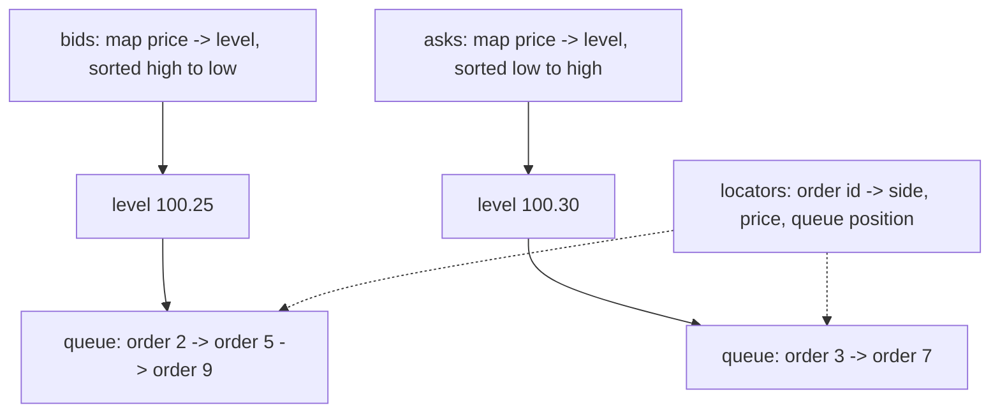

# Order Book Engine

A C++20 limit order book that matches orders by price, then by arrival time.
It supports the order types and book operations needed for a small, in-memory
matching engine.

This is a personal learning project. It handles one instrument on one thread.
It builds three programs:

- `order_book_tests` runs 28 tests with plain assertions.
- `order_book_sim` replays a hand-written session file.
- `order_book_random` generates random activity and checks the book after every
  instruction.

## Build and run

```bash
cmake -S . -B build -DCMAKE_BUILD_TYPE=Release
cmake --build build -j

./build/order_book_tests                        # run the tests
./build/order_book_sim data/sample_session.txt  # replay the sample session
./build/order_book_random                       # 20000 random instructions
./build/order_book_random 50000 4242            # 50000 instructions, seed 4242
```

## Supported operations

| Operation | Description |
| --- | --- |
| `submit` | Add an order and match it immediately against the other side |
| `cancel` | Remove an order that is still waiting in the book |
| `modify` | Change a waiting order's price or quantity, following queue-priority rules |
| `order` | Look up an order's status, filled quantity, remaining quantity, and whether it is still waiting |
| `best_bid`, `best_ask`, `spread`, `mid_price` | Read the best prices and the gap between them |
| `snapshot` | Read the top N price levels on one side |
| `quantity_at_price`, `resting_quantity`, `available_quantity` | Read available quantity, including hidden iceberg quantity |
| `statistics` | Read the last trade price, traded volume, trade count, high, and low |
| `validate` | Check every internal rule; the random tester calls this constantly |

### Order types

| Type | Behavior |
| --- | --- |
| Limit | Trades what it can; the remainder waits in the book |
| Market | Takes available orders at any price and never waits in the book |
| IOC (immediate-or-cancel) | Trades what is available now and cancels the remainder |
| FOK (fill-or-kill) | Trades the full quantity at once or does nothing |
| Iceberg | A limit order that shows only part of its total quantity |
| Post-only | Waits in the book, or is rejected if it would trade immediately |

### Order status

`order(id)` continues to report an order's status after it leaves the book.

```text
New -> PartiallyFilled -> Filled
  |          |
  +----------+--------> Cancelled     pulled, or unfillable remainder dropped
Killed                                fill-or-kill that could not be completed
Rejected                              post-only that would have traded
```

### Important matching rules

- **FOK includes hidden iceberg quantity.** Before trading, the engine totals
  all quantity at or better than the limit price. If that total is too small,
  the order is rejected and the book is unchanged.
- **A refilled iceberg goes to the back of its price queue.** A partly consumed
  displayed slice keeps its place. Once the slice is fully consumed, the next
  slice joins the back of the queue.
- **Only a same-price quantity reduction keeps queue priority.** A price change
  or quantity increase sends the order to the back of the new price level.

## Session files

The simulator reads one instruction per line. It ignores blank lines and lines
that begin with `#`.

```text
LIMIT    BUY|SELL  <price>  <quantity>
MARKET   BUY|SELL  -        <quantity>
IOC      BUY|SELL  <price>  <quantity>
FOK      BUY|SELL  <price>  <quantity>
POSTONLY BUY|SELL  <price>  <quantity>
ICEBERG  BUY|SELL  <price>  <quantity>  <display size>
CANCEL   <order id>
MODIFY   <order id>  <new price>  <new quantity>
STATUS   <order id>
BOOK
STATS
```

Market orders have no limit price, so use `-` in the price field.

## Random order flow

`order_book_random` generates orders, cancellations, and amendments around the
current midpoint. After every instruction, it checks that:

- the book is not crossed;
- each price level's cached quantities match its orders;
- there are no empty levels or zero-quantity orders; and
- every waiting order is still available through the ID lookup.

It also checks quantity conservation at the end. Every execution adds the same
quantity to one buyer and one seller, so total filled quantity must equal twice
the traded volume.

The instruction count and seed are command-line arguments. The rest of the mix
lives in `FlowSettings` in `src/random_flow.hpp`. A seed fully determines a
session, so record it to reproduce a failure. The exit code is non-zero if
anything goes wrong, which makes a sweep easy:

```bash
for s in $(seq 1 40); do ./build/order_book_random 20000 $s > /dev/null || echo "seed $s failed"; done
```

```text
submitted orders                cancels and amendments
  FOK        568                  cancelled          1384
  ICEBERG   1234                  cancel too late    1591
  IOC       1183                  amend kept place    450
  LIMIT     9166                  amend requeued      418
  MARKET    1139                  amend too late     1094
  POSTONLY  1773
```

The midpoint moves during the session because new prices use the current book,
not the starting price. That is a random walk, not an error.

## Data structure



The book uses three structures:

1. **Ordered maps for price priority.** Bids are sorted high to low and asks
   low to high, so the first price on each side is always the best one. The
   maps also make price levels easy to find and remove.
2. **A doubly linked list for time priority.** New orders join the back, and
   matching starts at the front. Refilling an iceberg moves it to the back in
   constant time without copying orders or invalidating iterators.
3. **A hash map for fast cancels.** Each order ID points to its exact queue
   position, so the engine can remove an order from the middle without scanning.

Prices are stored as integer cents, never as `double`. Floating-point values
that print the same can still compare differently, which is unsafe for a book
that compares prices constantly.

### Operation costs

Here, `n` is the number of distinct prices in the book.

| Operation | Cost |
| --- | --- |
| Add an order that does not trade | O(log n) to find the price, O(1) to queue it |
| Cancel | O(log n) to find the price, O(1) to remove it |
| Amend with a same-price quantity reduction | O(1) after the lookup |
| Match one waiting order | O(1) |
| Read the best bid or offer | O(1) |

## Files

```text
src/order.hpp        side, order type, status, order, and trade types
src/order.cpp        price parsing and formatting
src/order_book.hpp   book interface and data-structure notes
src/order_book.cpp   matching, waiting, cancelling, amending, validation
src/random_flow.*    random order generator
src/main.cpp         session-file replay tool
src/random_main.cpp  random-flow tester
tests/               28 cases using plain asserts
scripts/             builds the explanation page from the source and live runs
docs/html/           the explanation page
data/                sample session
```

## How it works, explained

`docs/html/order_book_explained.html` walks through the engine function by
function. It includes a connection diagram, the source for each function, and
real input and output captured by running the engine. Open it in a browser.

Rebuild it after changing the code:

```bash
uv run python scripts/build_explanation.py
```

## Out of scope

The engine does not include self-trade prevention, stop or pegged orders,
auctions, persistence, threading, or networking. `submit` returns the trades it
caused; there is no market-data feed.

Finished orders remain in memory for the life of the process. That is useful for
a simulator, but a production system would usually keep a rolling history.

## Possible next steps

- Add stop and stop-limit orders, with a trigger check after every trade.
- Add self-trade prevention keyed by participant ID.
- Replace the ordered maps with a flat array of price levels when the tick range
  is bounded; better cache locality can make that faster.
- Record every instruction so a failing random session can be replayed one line
  at a time through the session tool.
