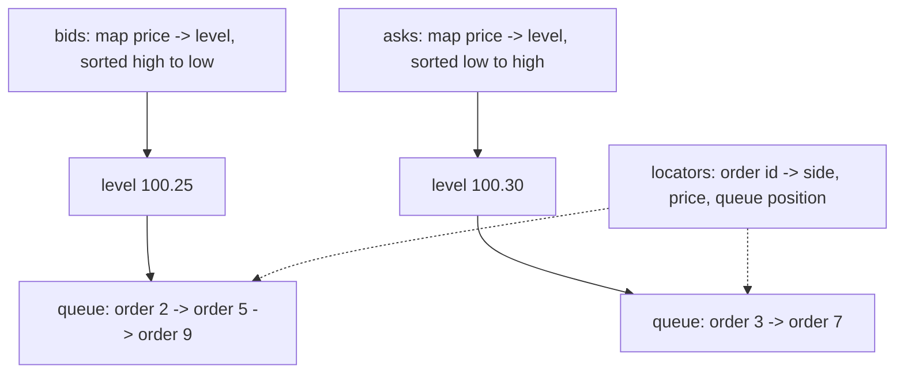

# Order Book Engine

A C++20 limit order book that matches orders using price-time priority. It
supports iceberg and fill-or-kill orders, plus a small command-line tool for
replaying a session file and printing the book after each step.

This is a personal learning project. It handles one instrument, runs on one
thread, and keeps everything in memory.

## Build and run

```bash
cmake -S . -B build -DCMAKE_BUILD_TYPE=Release
cmake --build build -j

./build/order_book_tests                        # 14 test cases, no framework
./build/order_book_sim data/sample_session.txt  # replay the sample session
```

You can also type orders directly:

```bash
./build/order_book_sim
```

## Session file format

Use one instruction per line. Blank lines and lines starting with `#` are
ignored.

```text
LIMIT   BUY|SELL  <price>  <quantity>
MARKET  BUY|SELL  -        <quantity>
IOC     BUY|SELL  <price>  <quantity>
FOK     BUY|SELL  <price>  <quantity>
ICEBERG BUY|SELL  <price>  <quantity>  <display size>
CANCEL  <order id>
BOOK
```

Market orders have no limit price, so use `-` in the price field. `BOOK` prints
the top levels on both sides.

## Order types

| Type | Behaviour |
| --- | --- |
| Limit | Trades what it can; the rest waits in the book |
| Market | Takes available orders at any price and never waits |
| IOC (immediate-or-cancel) | Takes what is available now and cancels the rest |
| FOK (fill-or-kill) | Fills the full size at once or does nothing |
| Iceberg | A limit order that shows only part of its total size |

Two details matter:

- **Fill-or-kill counts hidden size.** Before trading, the engine totals all
  resting quantity at or better than the limit price, including the hidden part
  of icebergs. If the total is too small, it rejects the order and leaves the
  book unchanged.
- **A refilled iceberg goes to the back of the queue.** When its displayed
  slice is fully consumed, the next slice joins the back of the queue at that
  price. A partly consumed slice keeps its place.

## How the book is built



Three structures make this work:

1. **Price priority** comes from two ordered maps, one per side. Bids sort from
   high to low and asks from low to high, so the first price on each side is
   always the best one. The maps also make it easy to find or remove a price.
2. **Time priority** comes from a doubly linked list (`std::list`) at each
   price. New orders join the back, matching takes from the front, and a
   refilled iceberg moves to the back with `splice`.
3. **Fast cancels** come from a hash map that points each order ID to its exact
   queue position. The engine can remove an order from the middle without
   scanning the queue.

Operation costs, where `n` is the number of distinct prices:

| Operation | Cost |
| --- | --- |
| Add an order that does not trade | O(log n) to find the price, O(1) to queue it |
| Cancel | O(log n) to find the price, O(1) to remove it |
| Match one resting order | O(1) |
| Read the best bid or offer | O(1) |

Prices are stored as integers measured in cents, never as `double`. Floating-
point values that print the same can still compare as different numbers, and
the book compares prices constantly.

## Files

```text
src/order.hpp        value types: side, order type, order, trade
src/order.cpp        price parsing and formatting
src/order_book.hpp   the book interface and the data structure notes
src/order_book.cpp   matching, resting, cancelling
src/main.cpp         command line tool that replays a session file
tests/               matching rule tests
data/                sample session
```

## What it does not do

There is no self-trade prevention, stop or pegged orders, auction support,
order modification, persistence, threading, or network layer. To modify an
order, cancel it and submit a new one. Trades are returned by `submit` instead
of being sent through a market-data feed.

## Possible next steps

- Add stop and stop-limit orders, with a trigger check after every trade.
- Add self-trade prevention keyed on a participant id.
- Replace the ordered maps with a flat array of price levels around the best
  prices. This can be faster when the tick range is bounded.
- Feed it a recorded message file and measure orders processed per second.
